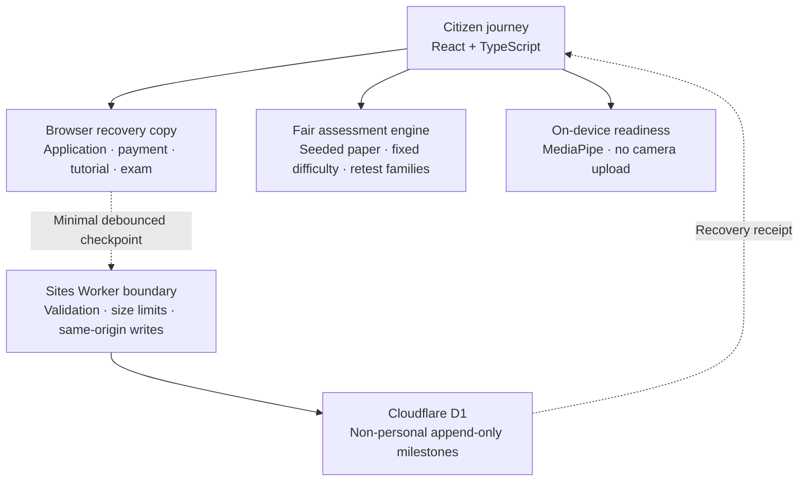

# LicenceFlow

LicenceFlow is an independent **Build What Moves India** hackathon prototype for the Madhya Pradesh Learner's Licence journey.

[Live prototype](https://licenceflow-mp-demo.eruditespartan108.chatgpt.site/) · [Implementation scope](docs/implementation-scope.md) · [Current roadmap](docs/latest-code-roadmap.md) · [Reliability layer](docs/reliability-layer.md)

Its practical goal is not merely to restyle a government form. It demonstrates how an online public service can discover device problems before payment, preserve progress through interruptions, prevent a duplicate mock payment, issue fair retests, and explain the next action without blaming the citizen for a technical failure.

> **Prototype boundary:** LicenceFlow is not a government website. Every applicant, Aadhaar check, document, payment, test attempt and licence shown here is synthetic. It creates no official record and moves no real money.

## Scope at a glance

| Surface | Current status |
|---|---|
| Madhya Pradesh Learner's Licence | Complete interactive prototype from application to a visibly invalid demonstration LL |
| Camera/microphone readiness | Real browser and on-device checks; the judge shortcut is explicitly simulated |
| Identity, government records, fee approval and issuance | Synthetic only; no department, UIDAI, bank or treasury connection |
| Other transport and permanent-DL services | Discoverable directory/reference pages, not working transactions |
| Durable reliability layer | Minimal non-personal milestone ledger; browser state is still the prototype's full recovery source |

The implementation boundary and state-extension seams are documented in [docs/implementation-scope.md](docs/implementation-scope.md).

## Try it

- Public prototype: [licenceflow-mp-demo.eruditespartan108.chatgpt.site](https://licenceflow-mp-demo.eruditespartan108.chatgpt.site/)
- Optional walkthrough: choose **Full Judge Walkthrough** on the homepage.
- Manual route: Driving licence services → Start new application.
- Judge-only shortcuts are visibly labelled and never presented as citizen rules.

## What is implemented

### Complete citizen journey

- seven-part Learner's Licence application with browser autosave;
- fictional e-KYC, document, portrait and signature handling;
- real browser camera/microphone/device checks plus a clearly labelled judge simulation;
- one-question system rehearsal before the fee step;
- synthetic payment gateway with explicit pending, failure, uncertain and confirmed states;
- YouTube learning gate with sequential-watch enforcement and a judge-only time shortcut;
- focused 15-question test interface with timer, narration and interruption recovery;
- result, answer explanations, journey receipt and visibly invalid demonstration licence;
- reviewed English/Hindi reference interfaces plus an accessible 23-language registry; the other 21 scheduled Indian languages remain visibly disabled until machine drafts receive native-language review;
- keyboard behavior, spoken questions and responsive mobile layouts.

### Fair assessment engineering

- 50 reviewed text questions with competency, difficulty and variant-family metadata;
- deterministic 15-question papers using a stable 6 easy / 7 medium / 2 applied blueprint;
- different retests that avoid the previous paper's question families without changing intended difficulty;
- non-personal paper fingerprint and attempt metadata;
- scoring through one tested reducer, including the judge passing-preview path.

### Failure-safe engineering

- local application, tutorial, payment and exam checkpoints survive refreshes;
- camera and microphone tracks are deterministically released on transitions and async-unmount races;
- monitoring rules are deterministic and proportionate: observe, guide, pause, record—never auto-accuse;
- MediaPipe model and WASM assets are self-hosted and camera inference stays on-device;
- a Sites Worker can mirror **minimal, non-personal milestones** to an append-only D1 ledger;
- repeated mock-payment confirmation uses the same idempotency key and returns the original receipt;
- if D1 or the network is unavailable, the UI honestly reports a browser-cache fallback.

The durable layer intentionally excludes applicant details, documents, camera frames, biometrics, question content and selected answers. See [docs/reliability-layer.md](docs/reliability-layer.md).

## Architecture



The full browser checkpoint is deliberately not called authoritative. A production licensing system would additionally move authenticated question delivery, timing, answers, scoring, entitlement and evidence review to government-controlled services.

## Verified state

As of 28 August 2026:

- **129 tests across 33 test files pass**;
- **17 applicable Playwright release checks pass** across desktop and Pixel 5 profiles, with three intentionally inapplicable matrix cases skipped;
- TypeScript and the production Sites bundle compile cleanly;
- the built artifact includes the Worker, D1 migration and hosting manifest;
- focused desktop/mobile tests cover the complete judge journey, payment failure, interruption reload/resume, reset, Raahi replay/escape behavior and horizontal-overflow protection.

The latest measured public Lighthouse baseline was 100 accessibility, 100 SEO and 100 agentic browsing. The main performance waste was oversized homepage artwork and an external render-blocking font request. The current source adds responsive WebP candidates and uses the already bundled Atkinson Hyperlegible font; a new score must be measured after deployment rather than guessed locally.

## Run locally

```bash
npm install
npm run dev
```

Verification:

```bash
npm run typecheck
npm test
npm run test:e2e
npm run build
```

Responsive homepage assets can be regenerated with Pillow:

```bash
python scripts/optimize-home-images.py
```

## Repository map

| Area | Purpose |
|---|---|
| `src/PortalApp.tsx` | Portal shell, homepage, routing composition and service catalogue |
| `src/portal/ApplicationFlow.tsx` | Seven-part application and upload journey |
| `src/portal/ReadinessJourney.tsx` | Device checks and system rehearsal |
| `src/portal/PaymentJourney.tsx` | Synthetic gateway and recovery states |
| `src/portal/TestJourney.tsx` | Learning, focused test, interruption, result and review |
| `src/content/` | Reviewed questions, blueprint and deterministic paper generation |
| `src/domain/` | Pure journey and monitoring decision reducers |
| `src/hooks/useDeviceReadiness.ts` | Media lifecycle and on-device MediaPipe observations |
| `src/portal/reliability.ts` | Privacy-bounded browser-to-server checkpoint synchronizer |
| `server/` | Sites Worker, optional Raahi API boundary and D1 reliability handler |
| `drizzle/` | Persistent D1 migration |
| `tests/e2e/` | Desktop/mobile release journey checks |
| `docs/latest-code-roadmap.md` | Current decisions, cut lines and future architecture |
| `docs/implementation-scope.md` | Canonical map of working, simulated and directory-only surfaces |

## Built with ChatGPT and Codex

LicenceFlow was created through a **human-led collaboration with ChatGPT and Codex**. The project's direction came from a real failed Learner's Licence experience: the applicant completed the form and payment, but a technical problem prevented the test from starting. The human creator defined the problem, chose the product principles, challenged weak ideas, tested the journeys on real devices and made the final design and scope decisions. AI accelerated the work; it did not replace that judgement.

| Part of the work | How ChatGPT and Codex helped |
|---|---|
| Research and product reasoning | Compared public-service journeys, organised official references and existing approaches, surfaced feasibility and fairness risks, and helped turn observations into the roadmap and explicit prototype/production boundaries. Claims were kept only when they could be supported or clearly labelled as proposed work. |
| Citizen experience | Helped rewrite bureaucratic language, examine failure states, plan English/Hindi guidance, structure Raahi's judge walkthrough and reason through accessibility, mobile layouts and recovery behavior. |
| Visual design and images | ChatGPT-assisted image generation was used to explore the Raahi mascot and synthetic demonstration artwork. Selected assets were then reviewed, cropped, compressed and integrated as responsive WebP/PNG resources rather than inserted blindly. |
| Engineering with Codex | Codex inspected and edited the React/TypeScript codebase, implemented reducers and UI states, traced browser bugs, integrated local MediaPipe assets, added the Sites Worker/D1 boundary, and kept mock services visibly separate from real integrations. |
| Verification | Codex helped write and run unit, integration and Playwright tests, reproduce refresh/interruption cases, inspect mobile overflow and accessibility behavior, run production builds and Lighthouse checks, and update technical documentation when the implementation changed. |
| Creative and editorial work | ChatGPT helped iterate demo scripts, explanations, question ideas and README structure. The creator selected, rewrote or rejected outputs to keep the final product consistent with the lived problem and hackathon goal. |

This repository intentionally keeps that collaboration inspectable: source code, tests, implementation boundaries, research notes and roadmaps sit together. AI-generated output was treated as a draft to verify—not as evidence, legal guidance, an accessibility audit or a substitute for government-domain expertise. A real deployment would still require native-language review, security testing, policy review, authoritative integrations and field testing with citizens.

## Raahi and OpenAI boundary

Raahi currently answers from reviewed built-in LicenceFlow guidance, so the public demo needs no API key and does not send chat content to a provider. The Worker contains a constrained optional OpenAI Responses API boundary with sensitive-data rejection, limited history, rate limiting and `store: false`; it remains disabled unless a server-side `OPENAI_API_KEY` is configured.

No secret belongs in Vite variables, frontend code, browser storage or the repository.

## Security and honesty

- The browser cannot stop a second phone, another monitor, screen recording or client-state modification.
- MediaPipe supplies context; it does not identify a person or issue a cheating verdict.
- Safe Exam Browser, anti-spoofing and real Aadhaar/payment integrations are future architecture, not hidden prototype claims.
- Question answers remain in the frontend bundle until a genuine authoritative exam service exists.
- Synthetic shortcuts and documents are visibly labelled.
- Machine-assisted language drafts require native-speaker and policy review before any official deployment; English and Hindi remain the reviewed reference versions.

The detailed claim boundary is in [docs/production-security-boundary.md](docs/production-security-boundary.md), and the current plan is in [docs/latest-code-roadmap.md](docs/latest-code-roadmap.md).
