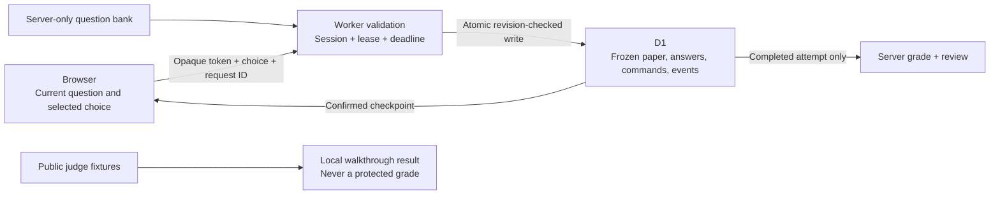

# Server-controlled assessment — first cheat-resistance slice

Implemented on 2 September 2026; the owner approved public release on 3 September and will perform the human browser check personally. This document describes source behavior; successful deployment, rather than this document alone, confirms availability on the public Site.

## What changed

The protected assessment has its own Worker endpoints, D1 tables and UI. The browser cannot supply an authoritative score, a correct-answer flag, a question order, or a deadline. The normal live-camera test entry opens it; judges can also choose **Open server-saved test** from the existing test-entry screen. The existing camera-free walkthrough and passing-preview shortcut remain separate simulations.

| Decision | Implementation |
|---|---|
| Paper and marking | Server selects 15 questions from the existing 50-question English bank; exact 6 easy / 7 medium / 2 applied proportions; shuffled options; immediate retest families avoided when inventory permits |
| Paper identity | Cryptographically random selection and opaque per-question tokens; frozen paper/rules in D1; a SHA-256-derived display fingerprint, not a signed credential |
| Question delivery | Only the current question, and only for the tab holding the current lease; no future paper, answer key, explanation or running correctness in active responses |
| Timing | 30 seconds per opened question, measured by server time; refresh/claim cannot restart it; 30-minute total attempt lifetime |
| Answers | Compare-and-swap on the attempt revision; answer, audit event and idempotency receipt committed in one D1 batch transaction |
| Lost save response | Retry the exact command; it cannot create a second answer or apply an old token to another question |
| Next question | Saving finishes in a `waiting` state. Only a separate question request starts the next timer, so a lost **save** response cannot spend time on an unseen next question |
| Interruption | Confirmed pause preserves time within a two-minute cumulative allowance; excess pause duration consumes the current question's remaining time |
| Concurrent tabs | One open attempt per anonymous session, one renewable 15-second tab lease; expiry permits reconnection without renewing the question timer |
| Result | Server grades from its frozen marking key; review is owner-scoped and locked until completion |
| Judge mode | Public sample fixtures and local scoring only; there is no server judge-pass route or request flag |

## Trust boundary



### Identity and privacy

- A 256-bit opaque cookie owns an anonymous prototype session. Only its SHA-256 hash is stored in D1. Hosted cookies use `__Host-`, Secure, HttpOnly, SameSite=Strict and Path=/; loopback HTTP uses a distinct local-development cookie.
- No account, government identity, fee entitlement, Aadhaar or applicant-document verification is implied. Cookies identify a browser session, **not a person**. A five-attempt per-session cap is a prototype bound, not protection against people minting new sessions.
- New exam tables store synthetic application reference, frozen questions, selected answers, marking, timestamps and server events. They do not store names, contact details, identity documents, camera frames, audio, or face templates.
- Session access expires after seven days. Expired sessions and their dependent exam rows are pruned in batches of up to 100 on later session creation. This is opportunistic cleanup, not a guaranteed seven-day physical-deletion scheduler.
- `sessionStorage` may contain one unacknowledged answer command for an exact retry. It contains no credential or grade. The server remains authoritative if this cache is edited, blocked or erased.
- Existing **Clear this device** controls clear the local demonstration, not the HttpOnly exam session or its server records. Server session revocation and user-directed deletion need a separate explicit feature.

### Timing and recovery details

An offline browser cannot pause a server timer until its pause request arrives. A confirmed earlier answer remains saved, but an unconfirmed current answer can time out. Similarly, the timer starts when the server processes a question-opening request, not when the browser paints its response. The interface states these limits rather than silently switching to client grading.

The server grants at most two minutes of cumulative pause allowance during an attempt. Repeated pause, resume, reload and claim calls do not replenish it. When the allowance is used, the current question's remaining time counts down even while paused. The final 30-minute expiry closes remaining questions unanswered. This is an explicit prototype policy to validate with users, not a claimed government examination rule.

Answers are immutable once committed. The public result has no legal effect. A later deployment cannot regrade a previously saved attempt using a changed bank because both its paper and rules are frozen.

### What this does not yet solve

- This is not a private content vault: the repository, its history and earlier published demo bundles contain the original question material. The new **runtime browser bundle** excludes the protected bank; a real confidential assessment would need unpublished content and its own access policy.
- A candidate controlling their browser can still copy a visible question, falsify browser observations or reuse a client identifier. The lease prevents ordinary competing-tab writes; it is not physical-device attestation.
- Camera signals are client-reported context, not server-verified liveness or identity. The existing guided camera simulation can demonstrate real server grading without opening hardware, and is labelled accordingly.
- Phone/object detection, face-cover improvements, depth/liveness experiments, audio analysis, OS lockdown, signed result credentials, authenticated applicant admission, administrator review, and abuse controls across identities remain future work.
- No online model, facial recognition, microphone transcription or prompt-injection watermark was added.
- The protected bank currently contains English questions. The navigation/help controls support English and Hindi; the entry screen explicitly tells Hindi users about the question-language limitation.

## Source map

- `server/exam/questionBank.ts`, `paper.ts`: server-only bank, secure shuffle, fixed blueprint.
- `server/exam/state.ts`: pure deadline, pause and answer transitions plus explicit public response allowlist.
- `server/exam/store.ts`: prepared SQL, atomic D1 batches, revision checks, owner-scoped lookup.
- `server/exam/api.ts`: validation, cookies, same-origin checks, endpoint authorization, idempotency and review gate.
- `db/schema.ts`, `drizzle.config.ts`, `drizzle/*protected_exam_core.sql`: generated schema migration. The pre-existing `0000_reliability.sql` remains unchanged and outside the new Drizzle snapshot.
- `src/portal/protectedExamClient.ts`: network boundary and pending-answer retry, with no local scoring fallback.
- `src/portal/ProtectedExamPage.tsx`: current question, recovery, server result and separate review, reusing the existing assessment shell.
- `src/portal/ProtectedExamStatus.tsx`: owner-scoped server progress on the application-status screen, separate from the walkthrough tracker.
- `server/dev/`: local Node SQLite adapter; never bundled into the production Worker. Both dev and built-preview servers use the real API handlers.
- `scripts/verify-exam-build.mjs`: verifies the packaged Worker and checks static output for protected bank leakage.

## Run and verify

Use Node 24 or newer for the local SQLite adapter and build verification script. Hosted execution is a Cloudflare Worker, not a Node server.

```bash
npm install
npm run dev
npm run test:exam
npm test
npm run build
npm run verify:exam-build
```

Local development uses `.tmp/licenceflow.sqlite`, ignored by Git. SQL migrations are applied locally by the development adapter, not on production requests. Production tables must be migrated by Sites during deployment. The old reliability handler remains a separate non-authoritative milestone mirror; none of its client-supplied fields can grade a protected attempt.

The migration tooling has a targeted override of `@esbuild-kit/core-utils`'s transitive esbuild to 0.25.12, removing GHSA-67mh-4wv8-2f99 from its older dependency chain. Migration generation and the build are verified with that override; no forced downgrade of Drizzle is used.

Automated checks include owner isolation, blocked score/time/bypass inputs, early review rejection, concurrent duplicate and conflicting answers, rollback on SQL failure, reload leases, stale question tokens, cumulative pause budgets, full expiry, retest balance, completion grading, session cleanup, lost responses after reload, stale response ordering and unavailable storage. They use migrated SQLite and the actual API, not a pretend always-successful grading function.

## Human browser check — owner requested

No browser automation or visual QA was run for this change; the owner asked to perform it personally.

1. On the test-entry screen choose **Open server-saved test**. In the existing judge camera simulation, it should explicitly say no camera is opened while answers/grades use the server.
2. Accept the anonymous answer-storage notice and start. Select an answer and lock it: the next question should appear smoothly, without showing correctness.
3. Pause, wait a few seconds, then reconnect. The same question should retain the remaining server time, not receive a fresh 30 seconds.
4. Reload while a question is open. Reconnect to the same attempt. If the former tab lease has not expired, the message should tell you when to retry; it must not create a new paper.
5. Open the same test in a second tab. It should not take control while the first tab remains active.
6. Finish the paper. Review should open only after the server result, with your choice, correct answer and explanation. Return to application status and reopen that server result.
7. Check the old Raahi walkthrough: demo fills, simulated camera, recovery preview, passing-result preview and demonstration downloads should still work separately.
8. Check phone width and Hindi controls. The protected English-question notice should be visible in Hindi, not a silent translation claim.

Older local judge papers are archived under their original storage prefix when their question IDs are retired. The sample test then restarts with an explanatory notice; form, mock payment and tutorial progress remain unchanged. Old answers are never attached to new questions and misgraded.

Publish only after the owner approves updating the existing public Site. A successful local Worker check does not verify that the hosted D1 migration has run.
